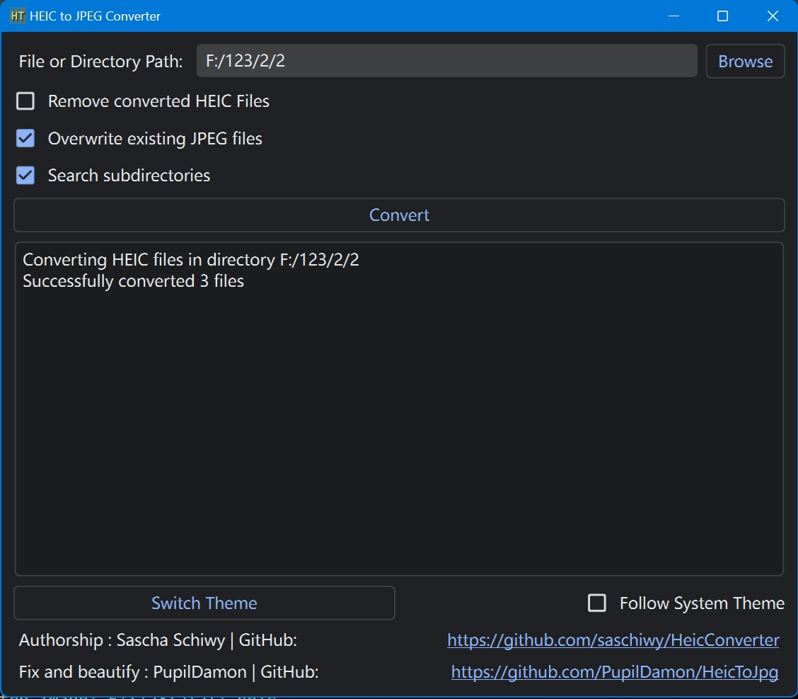

# HeicConverter

## Introduction

A very simple command line tool to convert *.heic files to jpg. Since the available programs for windows are either paid
or not working for me, I decided to make a simple python script to help convert these files.

## Features

- Convert all HEIC files to jpg in a folder and sub-folders recursively
- Skips already existing conversions
- Keep Metadata of the original file
- Optional: Remove source files
- Optional: Overwrite existing files

## Quick Usage

1. Copy the prepared exe to the folder with heic files for convert and double click it.
2. Use Command line and append the path of interest:

~~~~
./heicConverter.exe path/to/pictures
~~~~

## Command Line

Start the script (or exe) from command line for additional options:

~~~~
heicConverter.exe [-h] [-r] [-o] [--not-recursive] [--skip-prompt] path

Convert HEIC files to JPEG

positional arguments:
  path             the path to the file or directory to convert

options:
  -h, --help       show this help message and exit
  -r, --remove     Remove converted HEIC Files
  -o, --overwrite  Overwrite existing JPEG files
  --not-recursive  Do not search subdirectories
  --skip-prompt    Skip the prompt at the end
~~~~

## GUI

Also a GUI Version is available. Just start HeicConverterGui.exe.

## Installation

### Windows

Download the latest release from the [Release Page](https://github.com/saschiwy/HeicConverter/releases) and extract it
somewhere on your machine.

### Linux / Mac

Download the repo, install the dependencies and run the script.

## Development Dependencies

Install the python package dependencies with:

~~~~
pip install -r requirements.txt
~~~~

## Create your own executable

Install pyinstaller with:

~~~~
pip install pyinstaller
~~~~

Install the dependencies, navigate with a console to the source dir and run the following commands:

~~~~
python -m PyInstaller --onefile --console heicConverter.py
python -m PyInstaller --onefile --windowed heicConverterGui.py
pyinstaller.exe --onefile --noconsole  --add-data "ht.png;." --icon=.\ht.ico .\heicConverterGui_Dark.py
~~~~

## Remarks

This software was mainly created by people at StackOverflow:
https://stackoverflow.com/questions/54395735/how-to-work-with-heic-image-file-types-in-python

## Example

